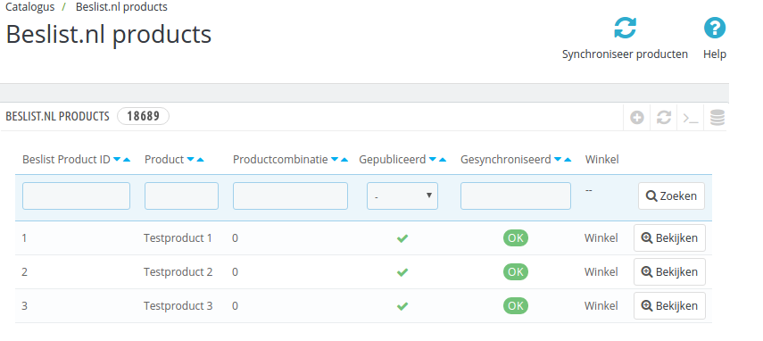
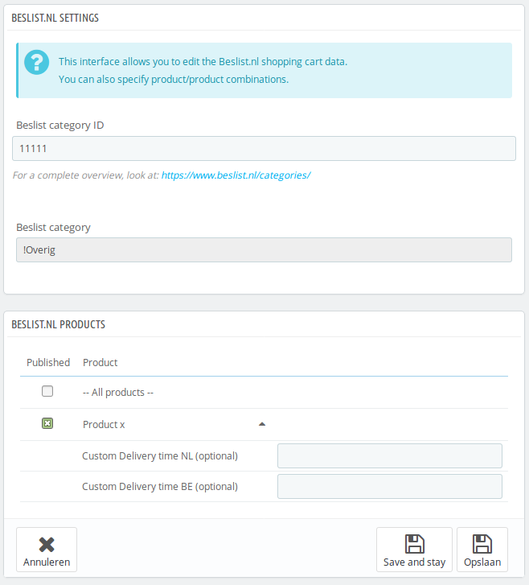

Products
=========

After installing the module, new options have appeared in the Prestashop menu. One of them is `Catalog` ->` Beslist.nl products`. When you navigate there, you will see an overview of all products in the system that are published on Beslist.nl.

    Beslist.nl producten

Selecting products
--------------------
Within Prestashop you can now set per product how it should be displayed on Beslist.nl. On the product editing page (under `Catalog`) you will find a tab with the title` Beslist.nl Shopping cart integration`. On that tab are the settings for Beslist.nl.

    Beslist.nl producttab

On this tab you will see an option for all product combinations to publish them (via the tick under `Publish '). You can also set a specific Beslist Delivery Time per combination.

When you click on the title of a product, you can adjust the delivery times:

 * `Custom Delivery time NL`: an override for Beslist.nl
 * `Custom Delivery time BE`: an override for Beslist.be

Update products
-------------------
The module ensures that a message is sent to Beslist.nl after certain adjustments have been made (currently these are adjustments to stock and price). This report happens under water, so you normally do not notice it.

Synchronize products
------------------------
When a new product is selected for Beslist, it is not included until after the next product feed run. So it usually takes a while before your product is visible. After the product is visible, stock and price updates can be processed quickly (via the normal update).

In the Beslist.nl product overview in your Prestashop installation you will see a list of all your products that have been selected for Beslist. A status is shown here. The following statuses are possible for a Decided publication:

* `OK` - This product has been correctly reported to Determined
* `New` - This product is new and has not yet (properly) been reported to Beslist
* `Stock updated` - The stock of this product has been updated, but has not (properly) been reported
* `Info updated` - The information (eg the price) of this product has been updated, but has not (properly) been reported

If there is a status other than 'OK' in the product overview, the 'Synchronize products' button at the top of the synchronization can be started manually. If you receive error messages during synchronization, you will receive a message. If the API is unavailable, you can try again later, but if incorrect data is sent, you may need to adjust the products.

Frequently Asked Questions
--------------------------

***Why do I get 404 notifications when I save my product?***

This is caused by the fact that the product is not yet known by Beslist. Certainly the product feed must first be re-read. This happens according to a certain schedule (at the time of writing 1 time a day at 8:00). For more information, see the `beslist handleidingen <https://cl.beslist.nl/pdf/Productfeed-handleiding%20voor%20Pro%20Shops%20NL.pdf>`_.

The products with 404 notifications can be offered the next day via the `Synchronize products` button. Then it continues to go well.
